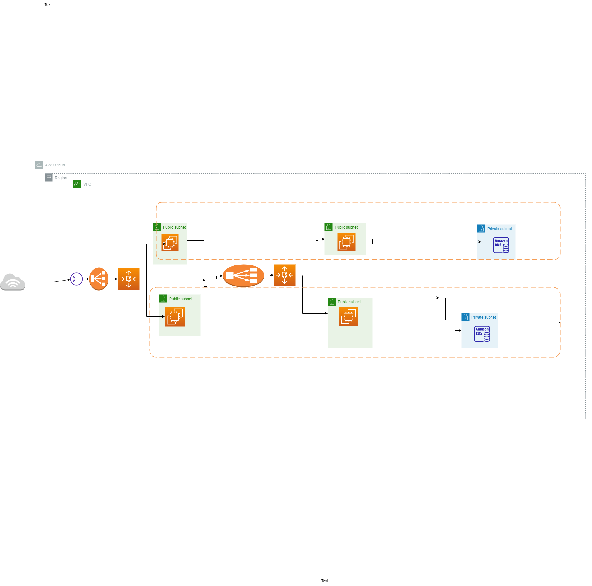

# ☁️ AWS Cloud Projects

This repository contains practical AWS Cloud projects focused on **cloud architecture, networking, security, scalability, high availability, and cost optimization**.

---

## 🚀 Project 1: Building a Highly Available, Scalable Web Application

📄 **Project Documentation:** [Open Project 1 PDF](project1.pdf)



### 🧩 Project Overview

This project demonstrates the design and deployment of a **highly available, scalable, secure, and cost-effective web application on AWS**, following the AWS Well-Architected Framework.

The application manages student records and allows users to:

* View student records
* Add student records
* Modify student records
* Delete student records

### 🏗️ AWS Services

* Amazon VPC
* Amazon EC2
* Amazon RDS
* Application Load Balancer
* Auto Scaling
* AWS Secrets Manager
* Security Groups

### 🎯 Key Concepts

* High Availability
* Auto Scaling
* Load Balancing
* Secure Database Architecture
* Network Security
* Cost Optimization
* AWS Well-Architected Framework

📄 **Complete project steps, screenshots, architecture, and cost estimation:**
[Open Project 1 Documentation](project1.pdf)

---

## 🚀 Project 2

📄 **Project Documentation:** [Open Project 2 PDF](project2.pdf)

Project 2 documentation, implementation steps, screenshots, and project details are available in the PDF below.

📄 [Open Project 2 Documentation](project2.pdf)

---

## 📚 Skills Demonstrated

Through these projects, I gained practical experience with:

* AWS Cloud Architecture
* Amazon VPC
* Amazon EC2
* Amazon RDS
* Application Load Balancer
* Auto Scaling
* AWS Secrets Manager
* Security Groups
* High Availability
* Scalability
* Load Balancing
* Network Security
* Cost Optimization

---

## 📁 Repository Structure

```text
AWS-Cloud-Projects/
│
├── README.md
├── project1.pdf
├── project2.pdf
└── Diagram.png
```

---

## 🎓 Learning Outcome

These projects demonstrate practical experience in designing and deploying **secure, highly available, scalable, and cost-effective AWS cloud solutions**.
